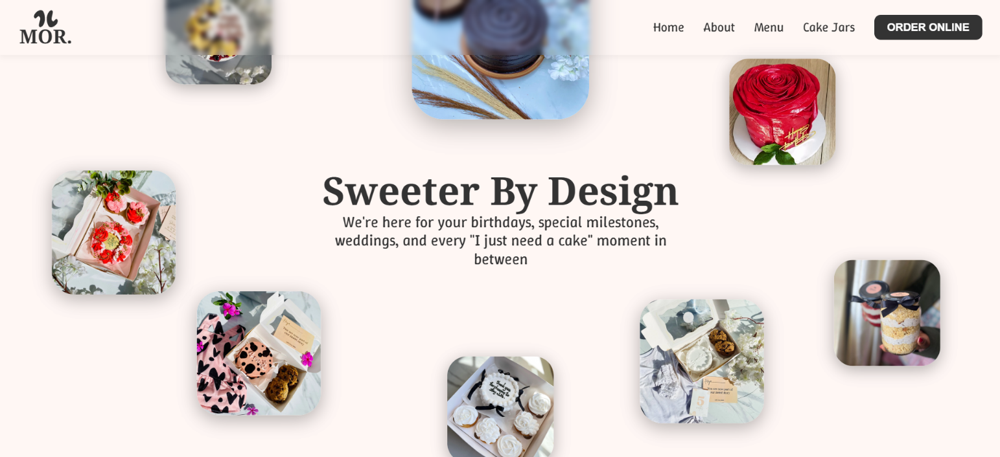
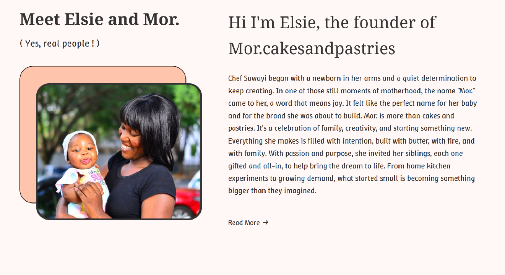
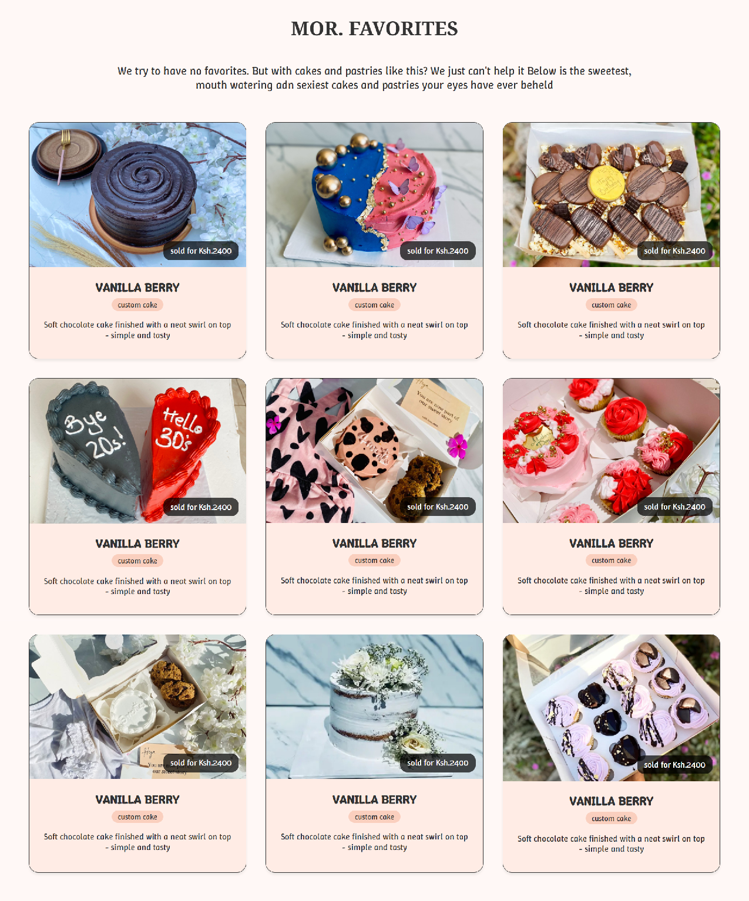
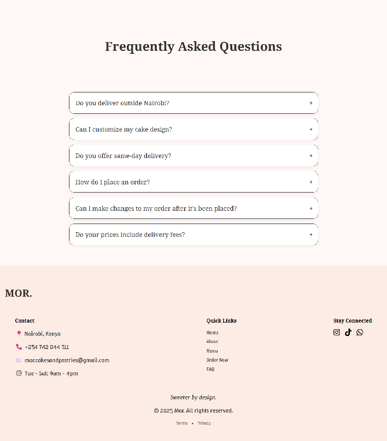
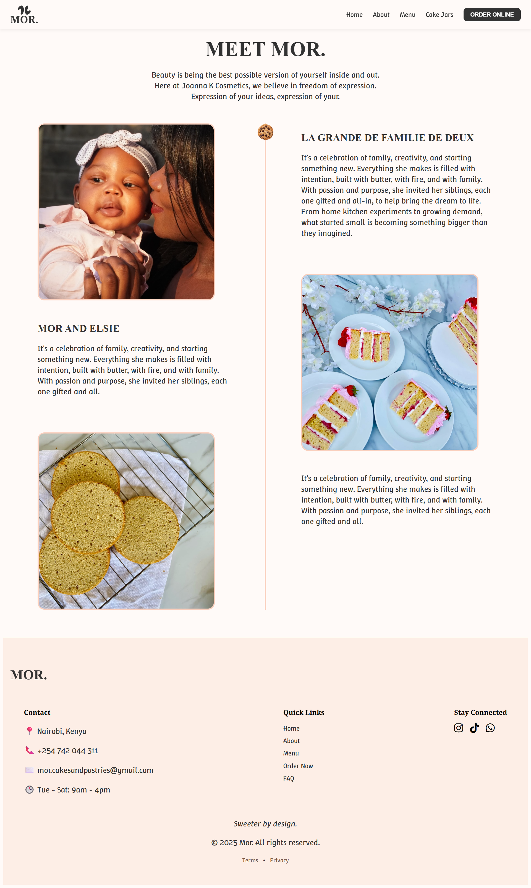
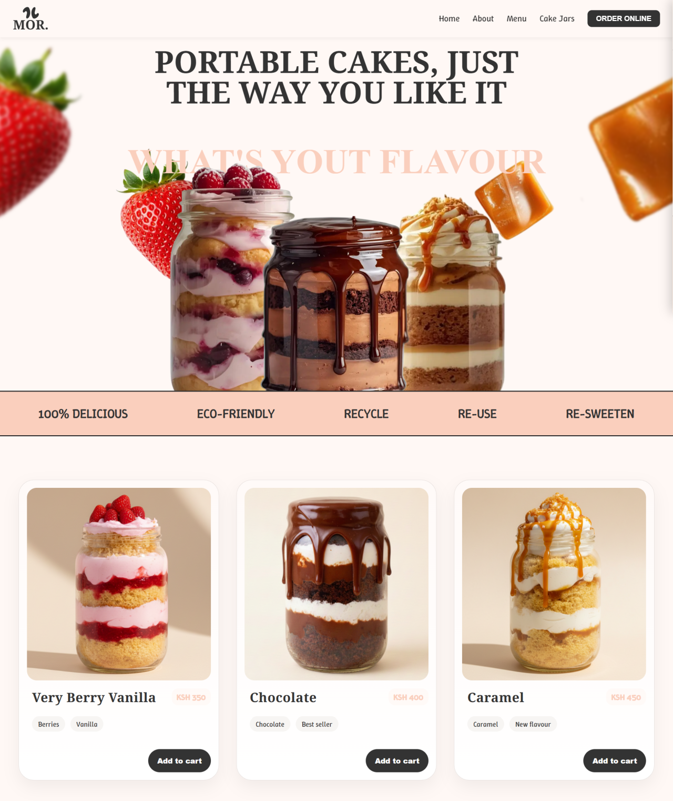
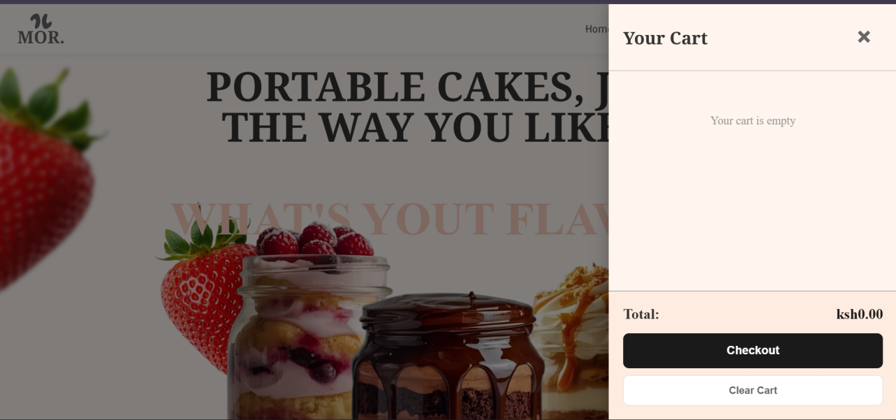
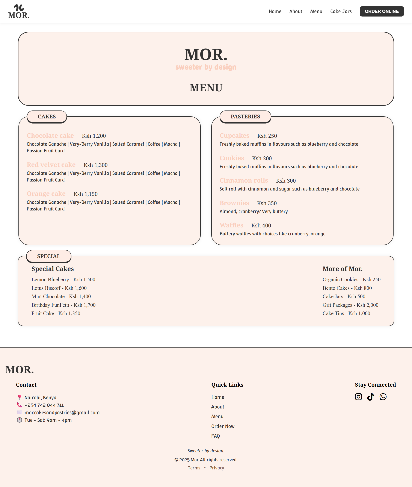
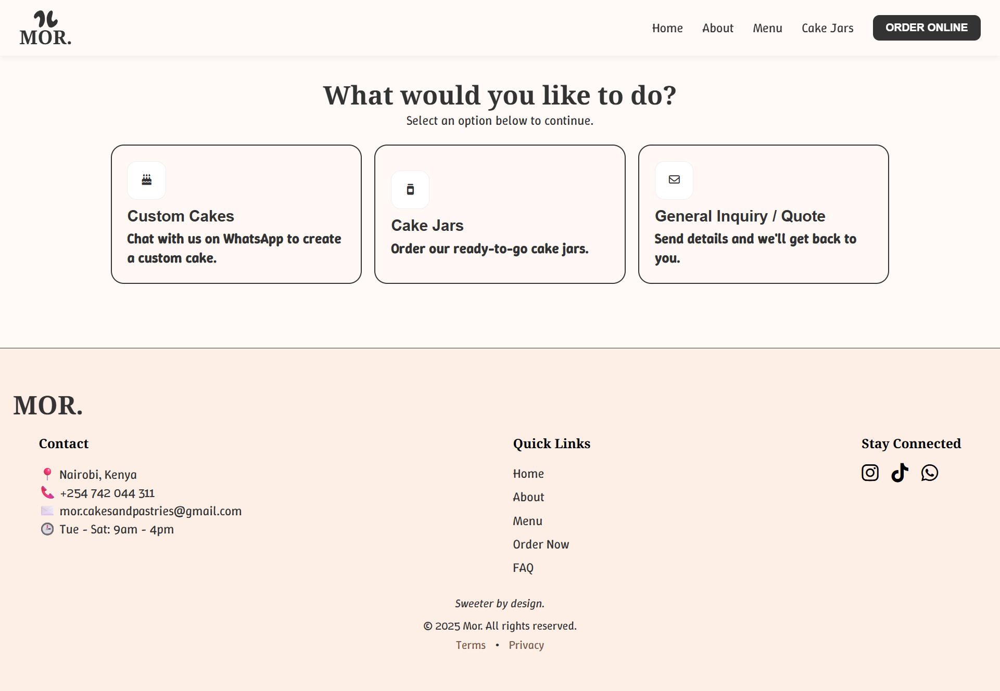
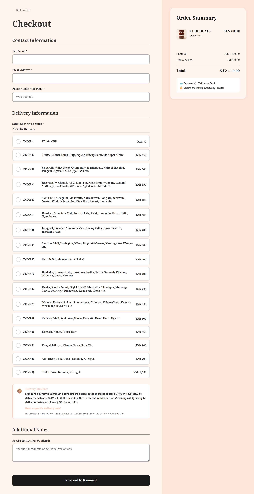

# Mor. Cakes and Pastries

[](https://opensource.org/licenses/MIT)
[](https://github.com/yourusername/mor-cakes)
[](https://mor-cakes.vercel.app)

```
Mor. Cakes and Pastries is an e-commerce web application built for my sister's bakery business. It was my first ever 'full' project made with html, css and javascript for the frontend and python-flask application for the backend; which mostly handles payment processing
```

## Preview (hero-section)
<p align="center">
  
</p>

## The Idea
Mor was made out of love for two things. My sister's niece (who was born the same year I started this website) and baking. We chose a brownish color, the one that is mostly seen in baked goods to reflect that 'raw and fresh' bakery feel. (I think that's how color theory works)


## Technologies Used

### Frontend

*   HTML5
*   CSS3
*   Vanilla JavaScript (ES6+)
*   [Vite](https://vitejs.dev/) for frontend tooling and development server
*   [GSAP](https://greensock.com/gsap/) for animations - (It was such a pain to use this library, but it was worth it)
*   [Swiper.js](https://swiperjs.com/) for carousels and image galleries
*   Font Awesome for icons

### Backend

*   Python 3.x
*   [Flask](https://flask.palletsprojects.com/) web framework
*   [Flask-CORS](https://flask-cors.readthedocs.io/) for cross-origin requests
*   [Requests](https://requests.readthedocs.io/) for HTTP calls
*   [python-dotenv](https://pypi.org/project/python-dotenv/) for environment variables
*   [Pesapal API](https://developer.pesapal.com/) for payment processing


## Pages

The website consists of the following pages:

- **Home (index.html)**: Landing page with hero section, what we do, featured products, testimonials, and frequently asked questions

<p align="center">
  
</p>
<p align="center">
  
</p>

<p align="center">
  
</p>

<p align="center">
  
</p>

---
---

- **About (about.html)**
    Despite it's simplistic design, this just so happens to be my favorite section. There's something about the pictures and the cookie in the middle that does down as you scroll that really means something to me. It's minimalistic, simple and has a lot of emotion carrying it. I just love it!


<p align="center">
  
</p>


- **Cake Jars (cake-jars.html)**: This is a dedicated page for the cake jars (A product that we were trying out that saw a lot of fruition). Did I say the previous section was my favourite? Scratch that. This is now my new favourite section. There's a certain parallax effect that I was chasing and it was exciting to go from an idea in my head to a website page. I achieved it with some CSS trickery with some painful trial and error.

<p align="center">
  
</p>

<p align="center">
  
</p>


- **Menu (menu.html)**: Product catalog displaying all available cakes and pastries. Not really happy with how it turned out, but hey, it's mine and I have to claim it proudly.

<p align="center">
  
</p>


- **Order (order.html)**: Order placement form for custom cake orders. Also not one of my best works, but it works, ...I think.

<p align="center">
  
</p>

- **Checkout (checkout.html)**: Shopping cart review and payment processing
- **Payment Callback (payment-callback.html)**: Payment confirmation and order status page

<p align="center">
  
</p>

## Features

- **Product Catalog**: Display of cakes, pastries, and cake jars with images and descriptions
- **Shopping Cart**: Add/remove items, quantity management, and cart persistence
- **Checkout Process**: Secure payment processing via Pesapal integration
- **Order Management**: Order placement and payment callback handling
- **Responsive Design**: Mobile-friendly interface with modern UI/UX
- **Animations**: Smooth GSAP animations for enhanced user experience
- **SEO Optimized**: Structured data and meta tags for better search visibility


## Project Structure

```
mor/
├── backend/
│   ├── app.py              # Flask backend application with Pesapal integration
│   └── requirements.txt    # Python dependencies
├── favicon/                # Favicon files and web manifest
├── public/                 # Static assets
│   ├── catalog/           # Product images
│   ├── icons/             # UI icons
│   ├── images/            # General images
│   ├── jars/              # Cake jar images
│   ├── socials_images/    # Social media images
│   ├── testimonials/      # Customer testimonial images
│   └── videos/            # Video assets
├── src/
│   ├── *.html             # HTML pages
│   ├── javascript/
│   │   ├── animations.js  # GSAP animations
│   │   ├── cakeJars.js    # Cake jars page functionality
│   │   ├── cartManager.js # Cart state management
│   │   ├── cartUI.js      # Cart UI components
│   │   ├── checkout.js    # Checkout process logic
│   │   ├── main.js        # Main application logic
│   │   └── order.js       # Order form handling
│   └── styles/
│       ├── *.css          # Page-specific stylesheets
│       └── global.css     # Global styles and variables
├── index.html             # Main entry point
├── package.json           # Frontend dependencies and scripts
└── README.md              # Project documentation
```

## API Endpoints

The backend provides the following API endpoints:

- `GET /` - Health check and API information
- `POST /pesapal/token` - Generate Pesapal OAuth token
- `POST /pesapal/submit-order` - Submit order to Pesapal for payment processing
- `GET /pesapal/order-status/<order_tracking_id>` - Check order payment status

## Development Process

This project was built following a component-based architecture with separation of concerns:

1. **Planning**: Wireframes and user flow design with figma ( such a stubborn tool when you have a laptop that constantly challenges your sanity )
2. **Frontend Development**: 
   - Built responsive HTML structure
   - Implemented CSS with mobile-first approach
   - Added JavaScript for interactivity and cart management
   - Integrated GSAP and Swiper JS for smooth animations
3. **Backend Development**:
   - Set up Flask application with CORS
   - Integrated Pesapal payment API (Also another pain in the apps)
   - Implemented secure token management
4. **Testing**: Cross-browser and mobile device testing
5. **Deployment**: Configured for production deployment


## Setup and Installation

### Prerequisites

- Node.js (v16 or higher)
- Python 3.8+
- Pesapal merchant account and API credentials

### Installation

1. **Clone the repository**
   ```bash
   git clone https://github.com/yourusername/mor-cakes.git
   cd mor-cakes
   ```

2. **Setup Frontend**
   ```bash
   npm install
   npm run dev
   ```

3. **Setup Backend**
   ```bash
   cd backend
   python -m venv venv
   # On Windows
   venv\Scripts\activate
   # On macOS/Linux
   source venv/bin/activate
   pip install -r requirements.txt
   ```

4. **Environment Setup**
   Create a `.env` file in the `backend` directory:
   ```
   PESAPAL_CONSUMER_KEY=your_consumer_key
   PESAPAL_CONSUMER_SECRET=your_consumer_secret
   PESAPAL_BASE_URL=https://cybqa.pesapal.com/pesapalv3
   ```

5. **Run the Application**
   ```bash
   # Terminal 1 - Frontend
   npm run dev

   # Terminal 2 - Backend
   cd backend && python app.py
   ```

The application will be available at:
- Frontend: `http://localhost:5173`
- Backend API: `http://localhost:5000`


## Lessons Learned

During the development of this project, several key learnings emerged:

### Technical Skills
- **Payment Integration**: Working with third-party APIs (Pesapal) and handling OAuth flows
- **Responsive Design**: Implementing mobile-first CSS and cross-device compatibility
- **State Management**: Managing cart state across page navigations using localStorage
- **Animation Libraries**: Leveraging GSAP for performant web animations
- **SEO Optimization**: Implementing structured data and meta tags for better search visibility

### Development Practices
- **Component Architecture**: I didn't use react initially as the main purpose of this project was to learn how to use javascript first. regardless I broke down sections of this website into 'components'. Doing this with vanilla javascript enabled me to appreciate why react exits.

- **Version Control**: Proper git workflow and commit practices

- **Environment Management**: Using environment variables for sensitive configuration

- **Error Handling**: Implementing proper error handling for API calls and user inputs

- **Performance Optimization**: Optimizing images and implementing lazy loading - quite

### Business Understanding
- **E-commerce Flow**: Understanding the complete customer journey from browsing to payment - I will one day use this for my startup

- **User Experience**: Importance of intuitive navigation and clear call-to-actions

- **Payment Security**: Handling sensitive payment information securely

- **Mobile Commerce**: Optimizing for mobile shopping experiences


## Acknowledgments

- **My Sister**: For the inspiration and business vision
- **My Niece**: Born the same year I started this project!
- **Open Source Community**: For the amazing tools and libraries that made this possible
- **Pesapal**: For their payment processing API - It's also so hard to use btw
- **Figma**: For the design planning - This tool is a pain in the apps

Special thanks to all the developers who shared their knowledge online - this project stands on the shoulders of giants and dwarfs alike

## License

This project is made public to document my journey, feel free to reach me at Barakacreal@gmail.com if you have any questions on how I did some of the things I did. Or better yet, If you want to hire me (*wink, *wink). The project is public to anyone who wants to fork it and view/continue it's development on their own. Happy coding fellow nerds

## Contact

For questions or support, please contact the development team. (That's me lol)

**If you found this project helpful ( or if you have a secret crush on me ) please give it a star!** 