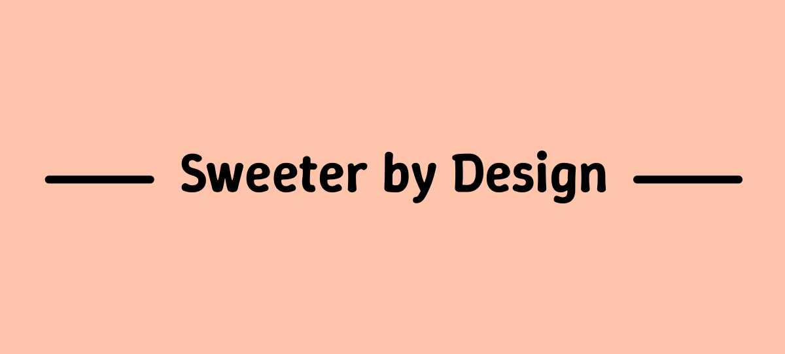
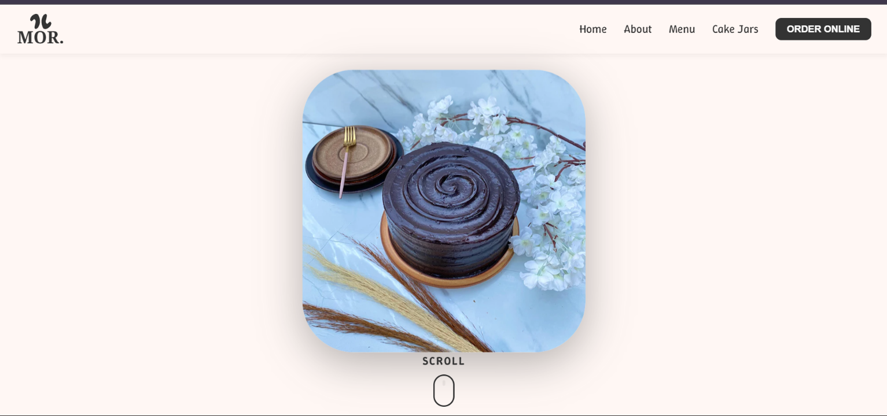

![Mor] (images/circle-logo.png)
![Mor] (images/logo.png)
# Mor. Cakes and Pastries



This is a full-stack e-commerce website for a bakery called "Mor. Cakes and Pastries". The frontend is built with HTML, CSS, and JavaScript, and the backend is a Python Flask application that handles payment processing with Pesapal.

## Features

- **Product Catalog**: Display of cakes, pastries, and cake jars with images and descriptions
- **Shopping Cart**: Add/remove items, quantity management, and cart persistence
- **Checkout Process**: Secure payment processing via Pesapal integration
- **Order Management**: Order placement and payment callback handling
- **Responsive Design**: Mobile-friendly interface with modern UI/UX
- **Animations**: Smooth GSAP animations for enhanced user experience
- **SEO Optimized**: Structured data and meta tags for better search visibility

<p align="center">
  
</p>

## Pages

The website consists of the following pages:

- **Home (index.html)**: Landing page with hero section, featured products, testimonials, and bakery information
- **About (about.html)**: Information about the bakery, story, and contact details
- **Cake Jars (cake-jars.html)**: Dedicated page for cake jar products with detailed descriptions
- **Menu (menu.html)**: Product catalog displaying all available cakes and pastries
- **Order (order.html)**: Order placement form for custom cake orders
- **Checkout (checkout.html)**: Shopping cart review and payment processing
- **Payment Callback (payment-callback.html)**: Payment confirmation and order status page

## Technologies Used

### Frontend

*   HTML5
*   CSS3
*   Vanilla JavaScript (ES6+)
*   [Vite](https://vitejs.dev/) for frontend tooling and development server
*   [GSAP](https://greensock.com/gsap/) for animations
*   [Swiper.js](https://swiperjs.com/) for carousels and image galleries
*   Font Awesome for icons

### Backend

*   Python 3.x
*   [Flask](https://flask.palletsprojects.com/) web framework
*   [Flask-CORS](https://flask-cors.readthedocs.io/) for cross-origin requests
*   [Requests](https://requests.readthedocs.io/) for HTTP calls
*   [python-dotenv](https://pypi.org/project/python-dotenv/) for environment variables
*   [Pesapal API](https://developer.pesapal.com/) for payment processing

## Project Structure

```
mor/
├── backend/
│   ├── app.py              # Flask backend application with Pesapal integration
│   └── requirements.txt    # Python dependencies
├── favicon/                # Favicon files and web manifest
├── public/                 # Static assets
│   ├── catalog/           # Product images
│   ├── icons/             # UI icons
│   ├── images/            # General images
│   ├── jars/              # Cake jar images
│   ├── socials_images/    # Social media images
│   ├── testimonials/      # Customer testimonial images
│   └── videos/            # Video assets
├── src/
│   ├── *.html             # HTML pages
│   ├── javascript/
│   │   ├── animations.js  # GSAP animations
│   │   ├── cakeJars.js    # Cake jars page functionality
│   │   ├── cartManager.js # Cart state management
│   │   ├── cartUI.js      # Cart UI components
│   │   ├── checkout.js    # Checkout process logic
│   │   ├── main.js        # Main application logic
│   │   └── order.js       # Order form handling
│   └── styles/
│       ├── *.css          # Page-specific stylesheets
│       └── global.css     # Global styles and variables
├── index.html             # Main entry point
├── package.json           # Frontend dependencies and scripts
└── README.md              # Project documentation
```

## API Endpoints

The backend provides the following API endpoints:

- `GET /` - Health check and API information
- `POST /pesapal/token` - Generate Pesapal OAuth token
- `POST /pesapal/submit-order` - Submit order to Pesapal for payment processing
- `GET /pesapal/order-status/<order_tracking_id>` - Check order payment status

## Development Process

This project was built following a component-based architecture with separation of concerns:

1. **Planning**: Wireframes and user flow design
2. **Frontend Development**: 
   - Built responsive HTML structure
   - Implemented CSS with mobile-first approach
   - Added JavaScript for interactivity and cart management
   - Integrated GSAP for smooth animations
3. **Backend Development**:
   - Set up Flask application with CORS
   - Integrated Pesapal payment API
   - Implemented secure token management
4. **Testing**: Cross-browser and mobile device testing
5. **Deployment**: Configured for production deployment

## Setup and Installation

### Prerequisites

- Node.js (v16 or higher)
- Python 3.8+
- Pesapal merchant account and API credentials

### Frontend

1.  Navigate to the root directory of the project.
2.  Install the necessary Node.js dependencies:
    ```bash
    npm install
    ```

### Backend

1.  Navigate to the `backend` directory:
    ```bash
    cd backend
    ```
2.  Create a Python virtual environment:
    ```bash
    python -m venv venv
    ```
3.  Activate the virtual environment:
    *   On Windows:
        ```bash
        venv\Scripts\activate
        ```
    *   On macOS and Linux:
        ```bash
        source venv/bin/activate
    ```
4.  Install the required Python packages:
    ```bash
    pip install -r requirements.txt
    ```
5.  Create a `.env` file in the `backend` directory and add your Pesapal API credentials:
    ```
    PESAPAL_CONSUMER_KEY=your_consumer_key
    PESAPAL_CONSUMER_SECRET=your_consumer_secret
    PESAPAL_BASE_URL=https://cybqa.pesapal.com/pesapalv3
    ```

## Running the Application

### Frontend

1.  In the root directory of the project, run the following command to start the Vite development server:
    ```bash
    npm run dev
    ```
    The frontend will be available at `http://localhost:5173`

### Backend

1.  Navigate to the `backend` directory.
2.  Run the Flask application:
    ```bash
    python app.py
    ```
    The backend API will be available at `http://localhost:5000`

## Building for Production

To build the frontend for production:

```bash
npm run build
```

The built files will be in the `dist` directory.

## Lessons Learned

During the development of this project, several key learnings emerged:

### Technical Skills
- **Payment Integration**: Working with third-party APIs (Pesapal) and handling OAuth flows
- **Responsive Design**: Implementing mobile-first CSS and cross-device compatibility
- **State Management**: Managing cart state across page navigations using localStorage
- **Animation Libraries**: Leveraging GSAP for performant web animations
- **SEO Optimization**: Implementing structured data and meta tags for better search visibility

### Development Practices
- **Component Architecture**: Breaking down UI into reusable components
- **Version Control**: Proper git workflow and commit practices
- **Environment Management**: Using environment variables for sensitive configuration
- **Error Handling**: Implementing proper error handling for API calls and user inputs
- **Performance Optimization**: Optimizing images and implementing lazy loading

### Business Understanding
- **E-commerce Flow**: Understanding the complete customer journey from browsing to payment
- **User Experience**: Importance of intuitive navigation and clear call-to-actions
- **Payment Security**: Handling sensitive payment information securely
- **Mobile Commerce**: Optimizing for mobile shopping experiences

## Contributing

1. Fork the repository
2. Create a feature branch (`git checkout -b feature/amazing-feature`)
3. Commit your changes (`git commit -m 'Add some amazing feature'`)
4. Push to the branch (`git push origin feature/amazing-feature`)
5. Open a Pull Request

## License

This project is private and proprietary.

## Contact

For questions or support, please contact the development team.